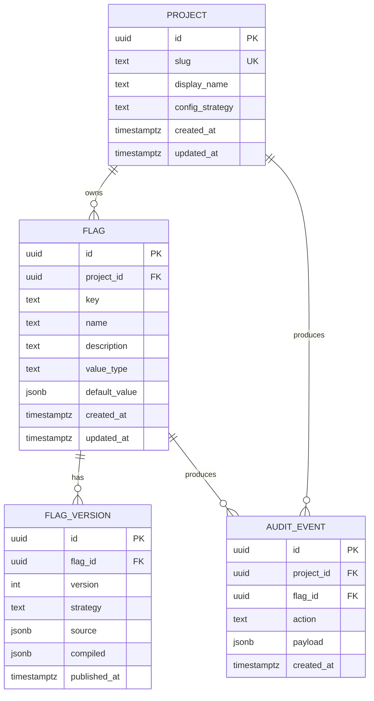

# Configuration Strategies (JSON, CEL, TypeScript)

## Overview

Slice 2 turns FalseFlag from a believable scaffold into a believable
feature-flag *platform*. It introduces the three config-as-code
strategies the demo pitches — **JSON**, **CEL**, and **TypeScript** —
behind a shared compiled intermediate representation (IR) so the
control-plane API, the evaluation proxy, and the JS SDK all consume
identical static rules trees. The slice also lands the persistence
layer (`flags`, `flag_versions`, `audit_events`) and the HTTP surface
that lets a user create a project, publish a flag version, and
evaluate it server-side end to end.

The headline test artifact is the **cross-runtime golden corpus** at
`tests/eval-corpus/`: Go and TypeScript evaluators both consume the
same JSON fixtures and must produce byte-identical Decision results
for every supported case.

## Problem Statement / Motivation

Slice 1 shipped the skeleton: binaries that boot, generators that
generate, a Postgres ready to receive writes, and a dashboard URL
that returns 200. None of it does anything yet — there is no flag
model, no evaluation, no persistence, no API beyond `/healthz`.

For PlatformCon, the demo's product narrative depends on three
things being visible:

1. **Project-scoped config strategies.** A user picks one of JSON,
   CEL, or TypeScript per project. This is the line item the talk
   leans on — "look, three authoring styles, one runtime."
2. **One compiled snapshot at the edge.** All three strategies emit
   identical static rules trees, so the proxy and SDKs only ever
   read JSON, never an expression language or a sandbox.
3. **Cross-language conformance.** The Go evaluator and the JS SDK
   evaluator agree on every fixture, proving the "one runtime" claim
   is real and not slideware.

Until slice 2 lands, the dashboard has nothing to display, the SDK
returns defaults, and the API can't accept a flag definition. Slice 2
is the load-bearing slice for everything downstream (operator,
dashboard, MCP, demo script).

## Proposed Solution

Build the slice in five phases, each committed directly to `main`
following the slice-1 cadence (~5–7 small commits per phase). The
deliverables, in dependency order:

1. **IR + strategy compilers + evaluator (Go-only).** Define the
   normalized rules tree. Implement JSON, CEL, and TypeScript
   compilers that all produce that tree. Build a single evaluator
   that takes IR + context → Decision. Cover with unit tests.
2. **Persistence.** New `flags`, `flag_versions`, `audit_events`
   tables via goose migration; sqlc-generated queries; an
   `internal/store` repository layer over `pgxpool`. API embeds
   migrations and runs them on startup.
3. **HTTP API + OpenAPI.** Expand the OpenAPI spec, regenerate
   oapi-codegen, implement handlers for projects, flags, versions,
   and evaluate. Hurl tests assert the full lifecycle. Orval
   regenerates the TS client.
4. **JS SDK + cross-runtime parity.** Rewrite `@falseflag/sdk` and
   `@falseflag/config` to consume the IR. Ship a tiny CEL-lite
   evaluator in JS that handles the demo's CEL subset. Move the
   corpus to `tests/eval-corpus/*.json` and wire both Go and Vitest
   test suites against it.
5. **End-to-end Hurl lifecycle + close-out.** One Hurl file that
   walks the full path for all three strategies against a fresh
   stack. Update METAPLAN status notes; flip plan status to
   `completed`.

## Technical Approach

### Architecture

Every strategy is a `Compiler` that produces a `Compiled` value
holding the same `IR` (normalized rules tree). The evaluator never
needs to know which strategy produced the IR.

```text
┌───────────────────────────────────────────────────────────────┐
│                         AUTHOR                                │
│  json source │  cel source         │  typescript DSL output   │
└──────┬───────┴────────┬────────────┴──────────┬───────────────┘
       │                │                       │
       ▼                ▼                       ▼
┌──────────────┐ ┌──────────────┐    ┌──────────────────────┐
│ json.Compile │ │ cel.Compile  │    │ typescript.Compile   │
│ (validate +  │ │ (cel-go parse│    │ (deserialize already-│
│  normalize)  │ │  + check)    │    │  JSON-shaped DSL out)│
└──────┬───────┘ └──────┬───────┘    └──────────┬───────────┘
       │                │                       │
       └────────────────┼───────────────────────┘
                        ▼
                ┌───────────────┐
                │   Compiled    │ ← stored as jsonb in flag_versions
                │ { strategy,   │
                │   source,     │
                │   ir }        │
                └───────┬───────┘
                        │
                        ▼
            ┌────────────────────────┐
            │ eval.Evaluate(ir, ctx) │  Go     ◀── identical decisions
            │ evaluator.evaluate(    │  TS     ◀── for shared corpus
            │   ir, ctx)             │
            └────────────────────────┘
                        │
                        ▼
                   ┌─────────┐
                   │Decision │ { value, reason, ruleId, version }
                   └─────────┘
```

#### IR shape (the load-bearing contract)

```json
{
  "value_type": "boolean | string | number | object",
  "default": <value>,
  "rules": [
    {
      "id": "rule-1",
      "when": <predicate>,
      "value": <value>
    }
  ]
}
```

Predicates form a small tree:

```json
{"kind": "eq",       "attr": "user.country", "value": "US"}
{"kind": "in",       "attr": "user.plan",    "values": ["pro", "enterprise"]}
{"kind": "gt",       "attr": "user.age",     "value": 18}
{"kind": "lt"/"gte"/"lte"/"neq": ...same shape}
{"kind": "matches",  "attr": "user.email",   "pattern": ".+@example\\.com$"}
{"kind": "rollout",  "attr": "user.id", "salt": "flag-key", "percent": 25}
{"kind": "all",      "of": [<predicate>, ...]}
{"kind": "any",      "of": [<predicate>, ...]}
{"kind": "not",      "of":  <predicate>}
{"kind": "cel",      "source": "user.age > 18 && user.country == 'US'"}
{"kind": "always"}
```

The first matching rule wins; if no rule matches, the default is
returned. Rules are evaluated in array order — this is deliberately
deterministic and trivial to mirror in both runtimes.

#### Strategy compilation rules

| Strategy   | Input                                  | Compile step                                                |
|------------|----------------------------------------|-------------------------------------------------------------|
| json       | JSON matching the IR shape directly    | validate via Go struct + jsonschema; normalize key order    |
| cel        | `{value_type, default, rules: [...]}`  | for each `{kind:"cel", source}`, parse+check with cel-go    |
|            | with CEL sources embedded as predicates| at compile-time; reject if cel-go reports issues            |
| typescript | The already-JSON output of `@falseflag/config` | structurally identical to JSON path; we treat the DSL  |
|            |                                        | as JSON for slice 2 (no QuickJS sandbox — that's deferred)  |

For slice 2 the TypeScript "compiler" is just deserialization +
validation. The actual sandbox (esbuild → QuickJS) is a future slice
per `docs/ideation/2026-05-20-moonconfig-historical-reference.md`.
The DSL output shape is JSON-serializable plain data by construction,
so this is honest, not a hack.

#### CEL parity (Go ↔ JS)

The Go side uses `github.com/google/cel-go` (current stable). The JS
SDK ships a hand-written CEL-lite evaluator (~250 LOC) covering only
the operators the demo fixtures need:

- Identifiers with dot access (`user.country`, `request.headers.x_geo`)
- Literals: string (single/double quote), number, bool, null
- Comparisons: `==`, `!=`, `<`, `<=`, `>`, `>=`
- Logical: `&&`, `||`, `!`
- Membership: `in` (right side must be a list literal)
- Parentheses

Mitigation for drift: the cross-runtime golden corpus exercises
every supported operator. If either side regresses, the conformance
test fails.

#### Database schema (goose migration `0002_flags.sql`)



- `flags`: `UNIQUE (project_id, key)`, `value_type` CHECK against
  `boolean|string|number|object`.
- `flag_versions`: `UNIQUE (flag_id, version)`, version monotonically
  assigned via `SELECT COALESCE(MAX(version), 0) + 1 FROM ...` inside
  a transaction. `strategy` CHECK matches the project's enum.
- `audit_events`: one row per `create_project | create_flag |
  publish_version | evaluate`. Sliced thin; full audit UI is slice 5+.
- Indexes: `flag_versions(flag_id, version DESC)`,
  `audit_events(project_id, created_at DESC)`.

#### API surface

| Method | Path                                                  | Body                                                   | 2xx Response                  |
|--------|-------------------------------------------------------|--------------------------------------------------------|-------------------------------|
| POST   | `/v1/projects`                                        | `{slug, display_name, config_strategy}`               | 201 Project                   |
| GET    | `/v1/projects`                                        | —                                                      | 200 `{items: Project[]}`      |
| GET    | `/v1/projects/{slug}`                                 | —                                                      | 200 Project                   |
| POST   | `/v1/projects/{slug}/flags`                           | `{key, name, description, value_type, default_value}` | 201 Flag                      |
| GET    | `/v1/projects/{slug}/flags`                           | —                                                      | 200 `{items: Flag[]}`         |
| GET    | `/v1/projects/{slug}/flags/{key}`                     | —                                                      | 200 Flag (with latestVersion) |
| PUT    | `/v1/projects/{slug}/flags/{key}`                     | `{strategy, source}`                                  | 200 FlagVersion (compile+store) |
| GET    | `/v1/projects/{slug}/flags/{key}/versions`            | —                                                      | 200 `{items: FlagVersion[]}`  |
| POST   | `/v1/projects/{slug}/flags/{key}/evaluate`            | `{context: {}}`                                       | 200 Decision                  |

All bodies and responses are documented in `api/openapi/openapi.yaml`
and round-trip through `oapi-codegen` (models + std-http-server +
embedded-spec) and `orval` (TS fetch client).

#### Runtime evaluation behavior

- `eval.Evaluate(compiled, ctx) -> (Decision, error)` is **pure**;
  no I/O, no context cancellation needed (CEL programs are
  pre-compiled at flag publish time).
- `Decision.Reason` is OpenFeature-shaped:
  `default | rule_matched | rollout_in_bucket | rollout_out_of_bucket | type_mismatch | error`.
- `Decision.RuleID` is empty for `default`, otherwise the matching
  rule's `id`.
- Rollout bucketing: `FNV-1a 64-bit hash of (salt + ":" + attrValue)`,
  mod 10000, `<= percent*100` means in-bucket. Both runtimes implement
  this identically.

### Implementation Phases

#### Phase 0: Dependency adds (1 commit)

- `go get github.com/google/cel-go@latest` — pin to current stable.
- `go get github.com/pressly/goose/v3@latest` — embedded migrations.
- `go mod tidy`.

Deliverable: `go.mod` / `go.sum` updated, `go build ./...` still passes.

#### Phase 1: IR + strategy compilers + evaluator (Go-only, ~6 commits)

Files:

- `internal/config/strategy.go` — `Strategy` enum, `Compiler` interface,
  `Compiled` struct, sentinel errors.
- `internal/config/ir.go` — `RulesTree`, `Rule`, `Predicate` types,
  JSON tag layout, validation helpers.
- `internal/config/json.go` — JSON strategy compiler (struct validation
  + normalization).
- `internal/config/cel.go` — CEL strategy compiler; walks IR, finds
  `{kind:"cel"}` leaves, parses + checks each with cel-go, attaches
  the compiled program to a parallel `programs map[string]cel.Program`
  on `Compiled` (not serialized — rebuilt on load).
- `internal/config/typescript.go` — TypeScript strategy compiler
  (deserialize the DSL output as JSON; validate it matches the IR
  shape; same normalization as JSON path).
- `internal/eval/eval.go` — `Decision`, `Evaluate(compiled, ctx)`.
- `internal/eval/predicates.go` — predicate dispatch.
- `internal/eval/rollout.go` — FNV-1a bucketing.
- Unit tests covering: each compiler accepts a happy path + rejects
  malformed input; the evaluator returns correct values + reasons
  for every predicate kind; rollout bucketing is deterministic and
  symmetric.

Acceptance: `go test ./internal/config/... ./internal/eval/...` green.

#### Phase 2: Database persistence (~5 commits)

Files:

- `db/migrations/0002_flags.sql` — goose migration creating `flags`,
  `flag_versions`, `audit_events`.
- `db/queries/flags.sql` — sqlc queries:
  - `CreateFlag` (returning row)
  - `GetFlagByKey` (joined with latest version via lateral)
  - `ListFlagsByProject`
  - `CreateFlagVersion` (input includes pre-computed next version)
  - `GetLatestFlagVersion`
  - `ListFlagVersions`
  - `AppendAuditEvent`
- `internal/db/**` — regenerated by `make generate-go`.
- `internal/store/store.go` — `Store` wrapping `*pgxpool.Pool` +
  embedded `*db.Queries`; transactional helper.
- `internal/store/migrations.go` — `//go:embed migrations` of the
  goose migration files (copy of `db/migrations` referenced via
  embed at `internal/store/migrations/*.sql` to avoid relative
  paths); `Migrate(ctx, log)` runs goose with the embedded FS.
- `internal/store/projects.go`, `flags.go` — repository methods
  layered over generated `db.Queries`.
- Wire `internal/server/server.go` to take `*Store` and call
  `Migrate` on startup (best-effort, logs and continues if DB URL
  empty).
- Update `internal/appconfig.LoadAPI` to require `DatabaseURL` only
  when caller wants DB-backed endpoints (server checks and degrades
  gracefully).

Acceptance: `make generate-go` idempotent, `go test ./internal/store/...`
green for the pure logic (integration test against compose's
postgres is in Phase 5).

#### Phase 3: HTTP API + OpenAPI + Hurl (~6 commits)

Files:

- `api/openapi/openapi.yaml` — full surface above, including
  schemas for Project, Flag, FlagVersion, Decision,
  EvaluationRequest, FlagSource (oneOf JSON | CEL | TypeScript).
- `internal/gen/openapi/api.gen.go` — regenerated by oapi-codegen.
- `internal/server/handlers/projects.go` — list/get/create.
- `internal/server/handlers/flags.go` — list/get/create + publish
  version (PUT).
- `internal/server/handlers/evaluate.go` — load latest version,
  call `eval.Evaluate`, return Decision.
- Refactor `internal/server/server.go`: split into `New(deps)` that
  takes a `Store` + `Evaluator`; wire mux from `routes(deps)`.
- `tests/hurl/projects.hurl` — create project, list, get by slug.
- `tests/hurl/flags.hurl` — create flag, publish version (JSON
  strategy), get latest, evaluate.
- `tests/hurl/evaluate.hurl` — evaluate with multiple contexts,
  assert reason + value.
- `js/packages/generated-client-ts/src/generated/api.ts` —
  regenerated by orval.

Acceptance: `make smoke` runs new Hurl files green against a live
API + Postgres from compose; `make generate && git diff --exit-code`
clean.

#### Phase 4: JS SDK + cross-runtime parity (~6 commits)

Files:

- `js/packages/config-ts/src/index.ts` — **replaced**. New
  flag-centric DSL emitting the IR shape directly:
  - `FalseFlag.flag({ key, valueType, default, rules })`
  - `FalseFlag.rule().when(predicate).serve(value)`
  - Predicate builders: `eq`, `neq`, `in`, `gt`, `gte`, `lt`,
    `lte`, `matches`, `rollout`, `all`, `any`, `not`, `cel`,
    `always`.
- `js/packages/sdk-js/src/ir.ts` — TypeScript types mirroring Go's
  IR.
- `js/packages/sdk-js/src/cel-lite.ts` — hand-written parser +
  evaluator for the CEL subset listed above.
- `js/packages/sdk-js/src/rollout.ts` — FNV-1a 64-bit (BigInt or
  pair of 32-bit halves) + bucketing.
- `js/packages/sdk-js/src/evaluator.ts` — `evaluate(ir, ctx)`
  mirroring `internal/eval/eval.go`.
- `js/packages/sdk-js/src/client.ts` — `createClient({ baseUrl,
  project })` that fetches latest flag IR over HTTP and evaluates
  locally; OpenFeature-shaped `getXValue` methods.
- `js/packages/sdk-js/src/index.ts` — re-exports.
- `tests/eval-corpus/*.json` — **~12–15 fixture files** spanning:
  - boolean default-off
  - boolean rule by eq
  - string variant by in
  - number rollout in-bucket
  - number rollout out-of-bucket
  - object value via matches
  - all/any/not composition
  - CEL predicate (3+ cases covering operators)
  - type_mismatch fallback
  - empty rules → default
- `js/packages/shared-eval-corpus/src/index.ts` — **replaced**.
  Loads `tests/eval-corpus/*.json` at module load via Node `fs`,
  exports `corpus: TestCase[]` and `loadCorpus()`.
- `js/packages/shared-eval-corpus/src/cross-runtime.test.ts` —
  Vitest suite asserting JS evaluator output matches `expected` for
  every fixture.
- `internal/eval/cross_runtime_test.go` — Go test that walks
  `tests/eval-corpus/`, compiles each fixture's strategy, evaluates,
  and asserts identical Decision shape.

Acceptance: `pnpm --dir js -r test` green; `go test ./internal/eval/...`
green; **same number of fixtures pass on both sides**.

#### Phase 5: End-to-end Hurl + close-out (~3 commits)

Files:

- `tests/hurl/flag-lifecycle.hurl` — single Hurl walk-through:
  1. Create project A with strategy=json.
  2. Create flag `checkout` in project A.
  3. PUT version 1 with strategy=json, source = full IR.
  4. Evaluate with two contexts, assert distinct reasons.
  5. PUT version 2 with strategy=cel, source = CEL-leaved IR.
  6. Evaluate again, assert CEL predicate fires.
  7. Create project B with strategy=typescript.
  8. Create flag `theme` in project B; PUT version with
     strategy=typescript, source = DSL-shaped JSON.
  9. Evaluate; assert object value returned.
- `scripts/smoke.sh` — extend to bring up DB + run all Hurl files;
  document FALSEFLAG_TEST_DATABASE_URL for CI use.
- `docs/METAPLAN.md` — Status Notes append: slice 2 commands run,
  checks passed, known gaps.
- Plan frontmatter status: `active` → `completed`.

Acceptance: full validation ladder green (see "Quality Gates" below).

## Alternative Approaches Considered

| Alternative                                                                | Why rejected                                                                                                          |
|----------------------------------------------------------------------------|-----------------------------------------------------------------------------------------------------------------------|
| Server-only CEL eval; JS SDK falls back to `/evaluate` for CEL flags       | Breaks the "one evaluator" demo story; introduces network dependency in SDK; harder to demo at the edge.              |
| Pre-evaluate every CEL predicate at publish time into a decision tree      | Loses CEL's dynamic-context behavior (`request.geo` can't be pre-evaluated). Forces non-CEL semantics.                |
| Embed QuickJS sandbox for TS strategy in slice 2                           | Doubles the slice; the user-facing story (three strategies, one runtime) lands without it. Defer to a sandbox slice.  |
| Run goose migrations as a separate `make migrate` step, not on startup     | Adds a setup ritual that breaks `make up` as a one-shot. Demo bar prefers zero-step bring-up.                         |
| Store CEL programs as serialized AST in jsonb                              | cel-go has no stable AST serialization API; recompiling from source on load is cheap and correct.                     |
| Put corpus inside `js/packages/shared-eval-corpus/fixtures/`               | Forces Go tests to know JS paths and ordering. `tests/eval-corpus/` is neutral, both runtimes read it cleanly.        |

## System-Wide Impact

### Interaction Graph

```text
HTTP request
   │
   ▼
ServeMux (internal/server/server.go)
   │
   ▼
Handler (internal/server/handlers/*.go)
   │   ┌─ writes audit event ─┐
   ▼                          ▼
Store (internal/store)   Store.AppendAuditEvent
   │                          │
   ▼                          ▼
db.Queries (sqlc)        db.Queries (sqlc)
   │                          │
   ▼                          ▼
pgxpool ─────────────────► Postgres
```

For evaluate path:

```text
POST /v1/.../{key}/evaluate
  → handler loads latest flag_version via Store
  → decodes Compiled.IR from jsonb
  → if strategy=cel, re-builds cel.Program for each CEL leaf
  → eval.Evaluate(ir, ctx) → Decision
  → appends audit_event{action="evaluate", payload={ctx, decision}}
  → writes JSON response
```

Things that fire that the eval call doesn't see:
- audit_event insert (best-effort, errors logged, don't fail response)
- access log via slog middleware (added in Phase 3)
- pgx connection acquire/release through the pool

### Error & Failure Propagation

| Layer            | Errors                            | Handled by                                  |
|------------------|-----------------------------------|---------------------------------------------|
| Compiler         | `ErrInvalidIR`, `ErrCELParseFailure` | Handler returns 400 with `{error, details}` |
| Store/sqlc       | `pgx.ErrNoRows`, FK violations    | Handler maps to 404 (not found) or 409 (conflict) |
| Evaluator        | Type mismatch, missing attr       | Returns Decision with `reason=type_mismatch` (200), not an HTTP error |
| Migrations       | Migration fails on startup        | API logs error and exits 1 (fail fast) — explicit, not silent |
| pgxpool          | Connection refused                | Handler returns 503; startup waits via compose `depends_on: service_healthy` |
| Audit append     | Write fails                       | Logged at WARN, evaluation response still returned |

No retry middleware in slice 2 (demo-quality). No fallback decision
chains either — fail loudly at compile time, succeed deterministically
at eval time.

### State Lifecycle Risks

| Step                                      | Risk                                                | Mitigation                                                                 |
|-------------------------------------------|-----------------------------------------------------|----------------------------------------------------------------------------|
| Migration on startup                      | Partial migration on crash                          | Goose tracks goose_db_version; restart re-runs idempotently.               |
| `CreateFlagVersion` version assignment    | Race: two concurrent publishes pick same N          | All version writes go through a serializable txn with `SELECT ... FOR UPDATE`; demo-acceptable. |
| Publish with bad CEL                      | Bad version stored, breaks eval forever             | Compile *before* insert; reject 400 if compile fails.                      |
| Compiled jsonb drifts from source         | Eval uses stale compiled                            | Re-compile at publish time only; never mutate compiled in place. New publish = new version. |
| Audit event write fails post-evaluate     | Decision served but not audited                     | Logged; not a correctness risk for demo.                                   |

### API Surface Parity

Eval-path code paths must agree across:

1. `internal/eval/eval.go` (Go evaluator) — used by `/evaluate` handler.
2. `js/packages/sdk-js/src/evaluator.ts` (JS evaluator) — used by SDK
   clients.
3. `cmd/falseflag-proxy/...` — slice 2 does **not** wire the proxy to
   real eval; that's slice 3. Proxy stays as the health-only stub.
4. Any later operator reconciliation that previews IR — slice 4.

The cross-runtime corpus tests (1) vs (2). The proxy and operator
will adopt one of those evaluators in their slice; no third
implementation.

### Integration Test Scenarios

Cross-layer tests that pure unit tests would miss:

1. **Publish JSON → evaluate → re-publish CEL → evaluate**: the
   second evaluate must use the new IR, not cached old programs.
   Asserts version-aware compile cache invalidation.
2. **Publish bad CEL**: PUT returns 400 with cel-go's diagnostic
   position; nothing stored; second PUT with valid CEL succeeds and
   gets version=1 (not 2). Asserts atomic compile-then-store.
3. **Evaluate with missing attribute**: predicate `eq attr=user.tier`
   when context omits `user.tier`. Decision must be deterministic
   (returns `reason=type_mismatch`, value=default); same in Go and JS.
4. **Rollout determinism**: same `(salt, attr value)` produces the
   same bucket in Go and JS for 100 different inputs (table-driven in
   corpus).
5. **Audit on evaluate failure path**: if the flag has no published
   versions, `/evaluate` returns 404 and writes an audit event with
   `action=evaluate_no_version`.

## Acceptance Criteria

### Functional Requirements

- [ ] `internal/config` exposes a `Compiler` interface and three
      concrete compilers (JSON, CEL, TypeScript) that share a single
      `Compiled` output.
- [ ] `internal/eval.Evaluate(compiled, ctx)` returns a `Decision`
      with `Value`, `Reason`, `RuleID`, `Version` fields.
- [ ] All predicate kinds (`eq`, `neq`, `in`, `gt`, `gte`, `lt`,
      `lte`, `matches`, `rollout`, `all`, `any`, `not`, `cel`,
      `always`) supported in Go.
- [ ] All non-CEL predicate kinds supported in JS; CEL subset
      supported as defined above.
- [ ] Goose migration `0002_flags.sql` creates `flags`,
      `flag_versions`, `audit_events`; goose embedded; runs on API
      startup when `FALSEFLAG_DATABASE_URL` is set.
- [ ] sqlc generates `internal/db` for the new queries; `make
      generate-go && git diff --exit-code` clean.
- [ ] HTTP API exposes all nine endpoints; matches updated OpenAPI
      spec exactly; orval-generated TS client compiles.
- [ ] Hurl tests (`projects.hurl`, `flags.hurl`, `evaluate.hurl`,
      `flag-lifecycle.hurl`) pass against `make up` stack.
- [ ] `@falseflag/config` (TS DSL) emits IR-shaped JSON; replaces
      the slice-1 stage/environment stub.
- [ ] `@falseflag/sdk` evaluates locally against the IR; OpenFeature-
      shaped methods.
- [ ] `tests/eval-corpus/` contains ≥12 fixtures; Go and JS
      cross-runtime tests both pass with byte-identical decisions
      where both runtimes support the strategy.

### Non-Functional Requirements

- [ ] No new top-level Go module dependencies beyond `cel-go`,
      `goose/v3`, and their transitive deps.
- [ ] No new top-level npm dependencies in `sdk-js` beyond what was
      already present (the CEL-lite parser is hand-written; no PEG
      libs).
- [ ] CEL compile-on-publish completes in <50ms for fixture inputs
      (informally checked; not asserted in CI).
- [ ] Migrations are reversible (`-- +goose Down` blocks present).
- [ ] All new exported Go symbols have package-level docs.

### Quality Gates

- [ ] `go build ./cmd/... && go test ./... && go vet ./...` clean.
- [ ] `make generate && git diff --exit-code` clean.
- [ ] `pnpm --dir js -r typecheck && pnpm --dir js -r test && pnpm
      --dir js -r build` clean.
- [ ] `pnpm --dir js lint` (Biome) clean.
- [ ] `make smoke` green end-to-end against compose-managed Postgres.
- [ ] `make up` boots the full stack and `flag-lifecycle.hurl`
      passes against it.

## Success Metrics

| Metric                                                                | Target                            |
|-----------------------------------------------------------------------|-----------------------------------|
| Cross-runtime corpus fixtures passing on both Go and JS               | 100% of fixtures both support     |
| Strategy compilers passing unit tests                                 | 100%                              |
| Hurl assertions in `flag-lifecycle.hurl`                              | All green                         |
| `make generate` idempotent (no dirty diff)                            | true                              |
| Commits on `main` for slice 2                                         | ~25 small, conventional commits   |
| Slice 2 wall-clock from start to plan close-out                       | Single session, mid-day demo bar  |

## Dependencies & Prerequisites

| Dependency                          | Source                            | Use                            |
|-------------------------------------|-----------------------------------|--------------------------------|
| `github.com/google/cel-go`          | Go module                         | CEL parse + eval               |
| `github.com/pressly/goose/v3`       | Go module                         | Embedded migrations            |
| `github.com/jackc/pgx/v5`           | Already present (slice 1)         | DB driver / pool               |
| Slice 1 generators (sqlc, oapi)     | Already pinned via `go tool`      | Regenerate db + api clients    |
| pnpm workspace (slice 1)            | Already present                   | New SDK + config builds        |
| `make up` Postgres                  | Slice-1 compose (just added)      | Integration target             |

No external service prerequisites. No new platform constraints.

## Risk Analysis & Mitigation

| Risk                                                          | Likelihood | Impact | Mitigation                                                                              |
|---------------------------------------------------------------|------------|--------|-----------------------------------------------------------------------------------------|
| CEL-lite JS parser disagrees with cel-go on an edge case      | M          | M      | Corpus exercises every supported operator; fail-fast on drift. CEL subset is small.    |
| FNV-1a bucketing differs between Go and JS due to BigInt math | L          | H      | Table-driven test with 100 (salt, value) → bucket pairs cross-checked.                  |
| sqlc + pgx pool ergonomics force big refactor in server.go    | M          | M      | Add a small Store layer; server holds Store; tests use the same Store with txn-rollback. |
| Goose migration on startup races with a second API replica    | L          | L      | Demo runs one replica; goose locks goose_db_version internally.                         |
| OpenAPI spec drift between handlers and `oapi-codegen` output | M          | M      | Handler signatures derive from the generated server interface (StrictServer pattern).   |
| TypeScript DSL change breaks slice-1 vitest fixtures          | H          | L      | Replace the fixtures together with the DSL in Phase 4; the slice-1 stub had no callers. |

## Resource Requirements

- One implementer (main thread, no fan-out for slice 2 — the IR is
  load-bearing and benefits from single-author consistency).
- Local Docker for compose-managed Postgres during Phase 2+.
- No external API keys / credentials.

## Future Considerations

Slice 2 explicitly defers:

- **Real-time push** (slice 3): the proxy will subscribe to flag
  changes; for now it stays health-only.
- **Operator reconciliation** (slice 4): CRDs will write through to
  the API. Out of scope here.
- **Dashboard UI for editing flags** (slice 5): the dashboard
  remains a placeholder. The generated client + IR types are wired
  so slice 5 has everything it needs.
- **TypeScript sandbox** (later slice): esbuild + QuickJS evaluation
  of user-submitted TS source. Slice 2 accepts the JSON output of
  the DSL only.
- **MCP / loadgen** (slice 6+): no changes.

Forward-compat: the `Compiled` struct carries `Strategy` so future
strategies (e.g. WASM-bundled config) can be added without API
breakage. The `audit_events` table is intentionally append-only.

## Documentation Plan

- `docs/METAPLAN.md` Status Notes: append the slice 2 verification
  record after Phase 5.
- `CONTRIBUTING.md`: add a short subsection on the eval corpus
  contract (`tests/eval-corpus/`) and a note about CEL subset parity.
- `README.md`: add a "Publish and evaluate a flag" quickstart that
  mirrors `flag-lifecycle.hurl` as `curl` commands.
- Plan frontmatter: flip `status` to `completed` at end.

## Sources & References

### Internal References

- Slice 1 plan: `docs/plans/2026-05-20-001-feat-foundation-monorepo-scaffold-plan.md`
- Metaplan: `docs/METAPLAN.md` (Configuration Strategies Plan prompt)
- Ideation: `docs/ideation/2026-05-20-synthetic-feature-flag-platform-depot-demo-ideation.md`
  (Idea #6 + #7, configuration-strategy direction)
- MoonConfig historical reference:
  `docs/ideation/2026-05-20-moonconfig-historical-reference.md`
  (TS-strategy conceptual seed)
- Existing stubs to replace:
  - `js/packages/config-ts/src/index.ts:42` (stage/env DSL — replaced)
  - `js/packages/sdk-js/src/index.ts:46` (default-returning client — replaced)
  - `js/packages/shared-eval-corpus/src/index.ts:23` (3-stub corpus — expanded + relocated)
- Existing surfaces to extend:
  - `internal/server/server.go:74` (`routes()` — gets per-resource handlers)
  - `internal/appconfig/appconfig.go:17` (`APIConfig.DatabaseURL` — now load-bearing)
  - `db/migrations/0001_init.sql` (projects — referenced by FK)
  - `api/openapi/openapi.yaml` (extended with new paths + schemas)

### External References

- cel-go: https://pkg.go.dev/github.com/google/cel-go
- CEL spec: https://github.com/google/cel-spec
- goose v3 embedded migrations: https://github.com/pressly/goose#embedded-migrations
- OpenFeature evaluation reasons:
  https://openfeature.dev/specification/types#resolution-details
- FNV-1a hash (Go + JS reference):
  https://en.wikipedia.org/wiki/Fowler%E2%80%93Noll%E2%80%93Vo_hash_function

### Related Work

- Slice 1 commits on `main` (most recent: `71cb602 feat(infra): add
  docker compose stack`)
