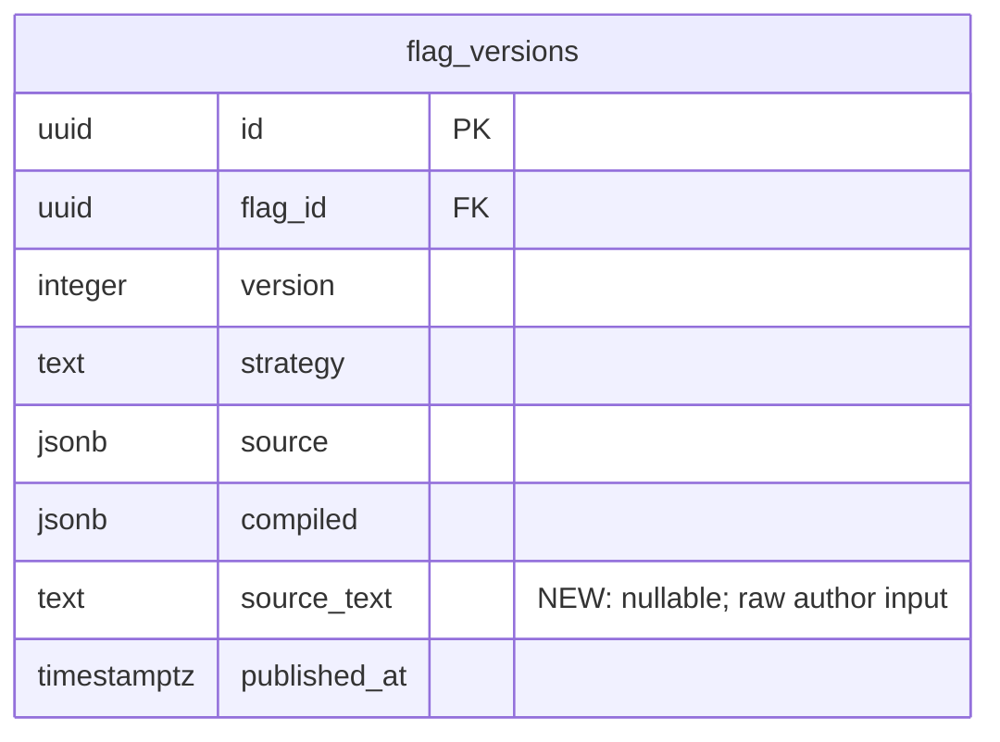

# Server-side TypeScript compilation + view/edit source UX

## Overview

Today FalseFlag's TypeScript "strategy" is TypeScript in name only: the CLI runs `tsx`, captures the DSL's default export, and uploads the resulting JSON IR. The server's TS compiler (`internal/config/typescript.go:27-48`) is a deserializer that rubber-stamps that IR. The dashboard never sees a line of TypeScript — only the compiled IR — which is why the flag detail page shows JSON for `typescript`-strategy flags and authoring drift between local repo and dashboard is invisible.

This plan ships two intertwined slices:

- **Slice A (backend):** Persist the original `.ts` / `.cel` / `.json` author input alongside the compiled IR in a new nullable `flag_versions.source_text` column. Replace the TS compiler stub with a real one — esbuild Go API to strip TypeScript, an embedded JS shim mirroring `@falseflag/config`'s builders, and a `goja` runtime per request to execute the result and capture the `default` export. The server becomes the authoritative compiler; the CLI keeps its local compile as a UX nicety and a smoke-check signal during migration.
- **Slice B (dashboard):** Render the persisted source on the flag detail page with Shiki SSR (zero client JS for highlighting). Add an `/edit` route with a lazily-loaded Monaco editor; on save, the Remix action posts to the same `PUT /v1/projects/{slug}/flags/{key}` endpoint, the server re-compiles, and compile errors surface inline.

The combination is the only point at which the demo narrative "FalseFlag is a real flag service with real authoring loops" survives contact with someone clicking on `typescript` and seeing `{"default":{"mode":"light"},...}`.

## Problem Statement

**1. The dashboard is honest about what's stored, which means it shows the wrong thing.** A user authoring a flag in TypeScript sees a typed builder API. The server sees only the compiled JSON. The dashboard renders what the server stored, so the TS evaporates between author and viewer. The simplest fix — pretty-print the IR — is what we do today; the resulting UX is the screenshot of `{"value":{"mode":"dark"},...}` with a `typescript` badge on top, which is worse than not having a badge at all because it implies the strategy is named after a representation that isn't here.

**2. Edits live exclusively in the repo + CLI loop.** Changing a flag value requires re-running `falseflag config publish`. For a conference demo where the audience expects to click a button and see a flag flip, that's a hole. We need an in-app affordance.

**3. The "TypeScript strategy" promise is half-delivered.** Per `internal/config/typescript.go:15`, "Slice 2 does NOT execute user-submitted TypeScript in a sandbox; the DSL emits plain JSON … A future slice will add esbuild + QuickJS evaluation." This is that future slice — minus QuickJS, which would force a glibc base image. `goja` is the pure-Go path that preserves the `distroless/static-debian12:nonroot` image at `infra/Dockerfile:30`.

**4. We're storing IR, not source — by design — and that decision is now load-bearing in three places** (CLI publish, snapshot compile, dashboard render). It's the right call for runtime evaluation but the wrong default for *authoring observability*. Adding a sibling `source_text` column is the cheapest correction: it doesn't touch the evaluation hot path or the snapshot format.

## Proposed Solution

### Backend (Slice A)

A new `source_text TEXT NULL` column on `flag_versions`. Old rows stay `NULL`; backward-compat is trivial because the column is nullable and every read path that cares falls back to pretty-printing `source`. Write path accepts `source_text` as an optional field on `PublishFlagVersionRequest` (both REST and Connect); when present, the server treats it as the authoritative input and re-compiles it.

The TS compiler (`internal/config/typescript.go`) gets rewritten:

1. `esbuild.Build()` (not `Transform()` — `Transform` cannot mark externals) with `Loader=TS`, `Format=CommonJS`, `External: ["@falseflag/config"]`, `Sourcemap=Inline`, `Bundle=true`, `Stdin{Sourcefile:"config.ts", ResolveDir:"/nonexistent"}`.
2. A `goja.Runtime` per request. Tie an `Interrupt()` to the request's `context.Context`: spawn a goroutine that selects on `<-ctx.Done()` and either a 1-second `time.NewTimer`, whichever fires first. `defer` both the timer stop and `vm.ClearInterrupt()`.
3. Inject a `require()` shim that resolves *only* `@falseflag/config` to an in-runtime object whose methods mirror `js/packages/config-ts/src/index.ts` exactly. The shim source is a Go `//go:embed`ed `.js` file living next to the compiler so it sits in version control with `gofmt`-style discipline.
4. After running the compiled CJS, read `module.exports.default`, `Export()` to `interface{}`, `json.Marshal`, hand to existing `validateTreeWith()` from `internal/config/cel.go:54`.

The JSON validator and CEL program compilation paths are unchanged; the new compiler hands the same `[]byte` shape to `validateTreeWith()` that the JSON compiler does today.

The conformance corpus at `tests/eval-corpus/` already has fixture `15-typescript-dsl-output.json` as the precedent for `typescript`-strategy fixtures. Adding fixtures exercising the new compile path is automatic — Go's `TestConformance` and JS's `cross-runtime.test.ts` pick them up.

CLI changes are narrow: when reading a TS file, send `source_text` (the raw text) and `source` (the locally-compiled IR) on the same request. The server prefers `source_text` if present and re-compiles. The locally-computed IR is dropped on the server with a debug log if it diverges, but accepted as-is when `source_text` is absent (old CLI binaries).

### Dashboard (Slice B)

Two routes change:

**`projects.$slug.flags.$key._index.tsx` (view, modified):** Loader fetches the flag and the latest version (already happens — `internal/server/handlers/flags.go` and the existing `useLoaderData` pattern). Loader also calls a new `app/lib/highlighter.server.ts` helper that returns Shiki-highlighted HTML. The `<pre>{JSON.stringify(latest.compiled, null, 2)}</pre>` block (line ~95-97) is replaced by a `<CodeBlock>` component that takes pre-rendered HTML and renders it via `dangerouslySetInnerHTML`. Strategy → language map: `json`→json, `typescript`→typescript, `cel`→javascript (no CEL grammar in Shiki). When `source_text` is absent, show the IR JSON with a muted "compiled IR — original source not stored" caption.

A new `<EditLink>` button next to the strategy badge goes to `/projects/:slug/flags/:key/edit`.

**`projects.$slug.flags.$key.edit.tsx` (new):** Loader fetches the same flag version. Component renders a route header + an `editor.client.tsx` wrapper around `@monaco-editor/react`, lazy-imported via `React.lazy(() => import("~/components/editor.client"))` inside a `<Suspense fallback={<EditorSkeleton/>}>` boundary. Submit posts to the route's Remix `action`, which calls the API's `PublishFlagVersion`. 422 responses surface as marker annotations on the editor (`editor.deltaDecorations`) when the API returns `{line, column, text}` shapes; the message also appears as a banner above the editor for accessibility.

Shiki is configured as a process-singleton with `createHighlighter({langs:["typescript","javascript","json"], themes:["github-light"], engine:createJavaScriptRegexEngine()})` — JS regex engine, not WASM, so Vite SSR build doesn't need to copy a `.wasm` asset.

Monaco uses the `.client.tsx` Remix 2.x convention. Vite needs `optimizeDeps.include: ["monaco-editor"]` and `MonacoEnvironment.getWorker` set via `?worker` imports before mount.

## Technical Approach

### Architecture

```
PUT /v1/projects/{slug}/flags/{key}
  ├── REST handler (internal/server/handlers/flags.go:109)
  │     ↓ decodes openapi.PublishFlagVersionRequest{strategy, source, source_text?}
  ├── Connect RPC (internal/server/rpc/flags.go:92)
  │     ↓ decodes pb.PublishFlagVersionRequest{strategy, source, source_text?}
  │
  ↓ shared "publish" coordinator
  ├── if source_text != "":
  │     config.Compile(strategy, []byte(source_text))   // server is authoritative
  │     if CLI also sent source_raw:
  │         compare canonical(compiled.IR) vs canonical(source_raw)
  │         on mismatch: slog.Warn(... + actor + project + flag + version); accept server compile
  ├── else:
  │     config.Compile(strategy, source_raw)            // legacy path; old CLI binaries
  ├── store.PublishFlagVersion(ctx, q, params)          // q from outer WithAudit txn
  │     INSERT flag_versions (..., source, compiled, source_text)
  └── audit_events row appended in same txn

GET /v1/projects/{slug}/flags/{key}                     // includes source_text (nullable)
  └── existing read path + nullable source_text passthrough

Dashboard view route loader → API GET → Shiki SSR highlight → HTML to render
Dashboard edit route action → API PUT → server compile → 200 or 422{line,column,text}
```

### Data model

`db/migrations/0004_flag_versions_source_text.sql` (new, goose-formatted):

```sql
-- +goose Up
ALTER TABLE flag_versions
    ADD COLUMN source_text TEXT NULL;

-- +goose Down
ALTER TABLE flag_versions
    DROP COLUMN source_text;
```

No length constraint at the DB level — enforce 32 KiB cap in the handler via `http.MaxBytesReader` and an explicit check on the unmarshaled field.

**ERD delta:**



### Generated artifacts (all driven by `make generate`)

- `db/queries/flags.sql:21` — `CreateFlagVersion`: add `source_text` to `INSERT` and parameter list, use `sqlc.narg('source_text')` for nullable bind.
- `db/queries/flags.sql:29-39` — `GetLatestFlagVersion` and `ListFlagVersions`: add `source_text` to `SELECT`.
- `internal/db/flags.sql.go` — regenerated; new column appears as `SourceText pgtype.Text`.
- `internal/store/types.go:35-43` — `store.FlagVersion`: add `SourceText string` (empty = NULL via existing `textFromString`/`textToString` helpers from `internal/store/audit.go`).
- `internal/store/flags.go:69-108` — `PublishFlagVersionParams`: add `SourceText string`.
- `api/openapi/openapi.yaml:731-738` — `PublishFlagVersionRequest`: add optional `source_text: string` (`maxLength: 32768`). Also add `source_text` to `FlagVersion` response schema (nullable).
- `internal/gen/openapi/api.gen.go` — regenerated.
- `js/packages/generated-client-ts/src/generated/api.ts` — regenerated by orval.
- `proto/falseflag/v1/flags.proto` — `PublishFlagVersionRequest`: add `optional string source_text = 5;` (proto3 `optional` is supported since 3.15 — keyword required so handlers can distinguish "absent" from "empty string"). `FlagVersion` message: add `optional string source_text = 8;`.
- `internal/gen/proto/falseflag/v1/flags.pb.go` + `falseflagv1connect/flags.connect.go` — regenerated by buf.

### The new TypeScript compiler

`internal/config/typescript.go` (replaces the existing 48-line stub):

```go
package config

import (
    "context"
    _ "embed"
    "encoding/json"
    "errors"
    "fmt"
    "time"

    "github.com/dop251/goja"
    "github.com/evanw/esbuild/pkg/api"
)

//go:embed typescript_shim.js
var dslShim string

type typescriptCompiler struct{}

func (typescriptCompiler) Strategy() Strategy { return StrategyTypeScript }

func (typescriptCompiler) Compile(source []byte) (*Compiled, error) {
    return compileTypescriptCtx(context.Background(), source)
}

func compileTypescriptCtx(ctx context.Context, source []byte) (*Compiled, error) {
    // 1. esbuild Transform stage: TS → CJS, sourcemap inline, external our DSL.
    res := api.Build(api.BuildOptions{
        Stdin: &api.StdinOptions{
            Contents:   string(source),
            Loader:     api.LoaderTS,
            ResolveDir: "/nonexistent",
            Sourcefile: "config.ts",
        },
        Bundle:    true,
        Format:    api.FormatCommonJS,
        Platform:  api.PlatformNode,
        External:  []string{"@falseflag/config"},
        Sourcemap: api.SourceMapInline,
        Write:     false,
        LogLevel:  api.LogLevelSilent,
    })
    if len(res.Errors) > 0 {
        return nil, esbuildErr(res.Errors)
    }
    if len(res.OutputFiles) != 1 {
        return nil, fmt.Errorf("%w: esbuild produced %d output files",
            ErrTypeScriptCompileFailure, len(res.OutputFiles))
    }
    js := string(res.OutputFiles[0].Contents)

    // 2. goja stage: run the CJS, bound by context + 1s wall clock.
    vm := goja.New()
    vm.SetMaxCallStackSize(2048)

    deadline := time.NewTimer(time.Second)
    defer deadline.Stop()
    done := make(chan struct{})
    defer close(done)
    go func() {
        select {
        case <-done:
        case <-ctx.Done():
            vm.Interrupt(ctx.Err())
        case <-deadline.C:
            vm.Interrupt(errTSDeadline)
        }
    }()
    defer vm.ClearInterrupt()

    // wire up module/exports + a single-module require
    module := vm.NewObject()
    exports := vm.NewObject()
    _ = module.Set("exports", exports)
    _ = vm.Set("module", module)
    _ = vm.Set("exports", exports)
    if _, err := vm.RunString(dslShim); err != nil {
        return nil, fmt.Errorf("%w: shim load: %s", ErrTypeScriptCompileFailure, err)
    }
    shim := vm.Get("__falseflag_dsl")
    _ = vm.Set("require", func(call goja.FunctionCall) goja.Value {
        name := call.Argument(0).String()
        if name == "@falseflag/config" {
            return shim
        }
        panic(vm.NewTypeError("require() not allowed: " + name))
    })

    if _, err := vm.RunString(js); err != nil {
        return nil, gojaErr(err)
    }

    def := vm.Get("module").ToObject(vm).Get("exports").ToObject(vm).Get("default")
    if def == nil || goja.IsUndefined(def) {
        return nil, fmt.Errorf("%w: missing default export", ErrTypeScriptCompileFailure)
    }

    irJSON, err := json.Marshal(def.Export())
    if err != nil {
        return nil, fmt.Errorf("%w: %s", ErrTypeScriptCompileFailure, err)
    }
    if len(irJSON) > 32*1024 {
        return nil, fmt.Errorf("%w: IR exceeds 32KB", ErrTypeScriptCompileFailure)
    }

    // 3. Reuse the JSON path for validation + CEL program compile.
    var tree RulesTree
    if err := json.Unmarshal(irJSON, &tree); err != nil {
        return nil, fmt.Errorf("%w: %s", ErrInvalidIR, err)
    }
    if err := validateTreeWith(&tree, true); err != nil {
        return nil, err
    }
    env, err := celEnv()
    if err != nil {
        return nil, fmt.Errorf("%w: %s", ErrCELCompileFailure, err)
    }
    programs := map[string]CELProgram{}
    if err := compilePredicates(tree.Rules, env, programs); err != nil {
        return nil, err
    }
    return &Compiled{
        Strategy:    StrategyTypeScript,
        IR:          &tree,
        CELPrograms: programs,
    }, nil
}

var (
    ErrTypeScriptCompileFailure = errors.New("typescript compile failure")
    errTSDeadline               = errors.New("typescript compile deadline exceeded")
)
```

A new sentinel `ErrTypeScriptCompileFailure` joins the existing list in `internal/config/strategy.go:64-71`. The handler's existing error-classification logic (`internal/server/handlers/errors.go` or wherever 4xx mapping lives — confirm during implementation) classifies it as 422.

### typescript_shim.js (embedded)

```js
// Mirrors js/packages/config-ts/src/index.ts. Hand-maintained, conformance-tested.
const eq        = (attr, value)   => ({ kind: "eq",        attr, value });
const neq       = (attr, value)   => ({ kind: "neq",       attr, value });
const isIn      = (attr, values)  => ({ kind: "in",        attr, values });
const gt        = (attr, value)   => ({ kind: "gt",        attr, value });
const gte       = (attr, value)   => ({ kind: "gte",       attr, value });
const lt        = (attr, value)   => ({ kind: "lt",        attr, value });
const lte       = (attr, value)   => ({ kind: "lte",       attr, value });
const matches   = (attr, pattern) => ({ kind: "matches",   attr, pattern });
const rollout   = (attr, salt, percent) => ({ kind: "rollout", attr, salt, percent });
const all       = (...predicates) => ({ kind: "all", of: predicates });
const any       = (...predicates) => ({ kind: "any", of: predicates });
const not       = (predicate)     => ({ kind: "not", of_one: predicate });
const cel       = (source)        => ({ kind: "cel", source });
const always    = ()              => ({ kind: "always" });

const rule = (id, when, value) => ({ id, when, value });
const flag = ({ value_type, default: def, rules }) => ({
  value_type,
  default: def,
  rules,
});

const FalseFlag = { flag, rule, eq, neq, in: isIn, gt, gte, lt, lte,
                    matches, rollout, all, any, not, cel, always };

// Export shape mimicking the TS package's named + namespace exports.
this.__falseflag_dsl = {
  flag, rule, eq, neq, in: isIn, gt, gte, lt, lte,
  matches, rollout, all, any, not, cel, always,
  FalseFlag, default: FalseFlag,
};
```

### Implementation Phases

#### Phase 1 — Schema + sqlc + store (foundation, no behavior change yet)

Tasks:
- `db/migrations/0004_flag_versions_source_text.sql` — Up/Down per goose convention.
- `db/queries/flags.sql` — add `source_text` to `CreateFlagVersion` INSERT + `GetLatestFlagVersion`, `ListFlagVersions`, `ListLatestFlagVersions` SELECTs.
- `make generate-go` regenerates `internal/db/flags.sql.go`.
- `internal/store/types.go:35-43` — extend `store.FlagVersion`.
- `internal/store/flags.go:69-108` — extend `PublishFlagVersionParams` + `PublishFlagVersion` body to pass `source_text` through.
- Touch nothing else. Schema-only PR if we wanted to split, but kept together with rest for demo timeline.

Success criteria:
- `go build ./...` clean.
- `make generate-check` clean.
- `go test ./internal/store/...` passes (including the existing integration test, which will see a new column appear in row scans).

Estimated effort: ~2 hours.

#### Phase 2 — esbuild + goja + shim (the core change)

Tasks:
- `go get github.com/evanw/esbuild` (vendored module — pure Go).
- `go get github.com/dop251/goja` (pure Go, pin to current pseudo-version).
- `internal/config/typescript.go` — rewrite per the snippet above.
- `internal/config/typescript_shim.js` — the embedded shim.
- `internal/config/typescript_test.go` — table-driven cases covering: happy path with a fixture that uses every builder; a malformed input (esbuild syntax error); a `while(true){}` infinite loop with a 50ms ctx deadline (asserts `ctx.Err()` propagates as interrupt); a `require("fs")` attempt (asserts TypeError); an IR exceeding 32KB; a missing default export.
- `internal/config/typescript_conformance_test.go` — load each `tests/eval-corpus/*.json` fixture where `strategy == "typescript"`, take its `source_text` (new fixture field — populate alongside the existing `ir` field), compile server-side, assert deep-equal to the fixture's `ir`. This is the parity test the spec-flow analysis flagged as missing.

Success criteria:
- `go test ./internal/config/...` passes.
- `go test ./internal/sdkgo/...` (existing conformance) stays green.
- New corpus fixtures (added later in Phase 6) pass when they arrive.

Estimated effort: ~5 hours (most of it on the conformance test fixture wiring + shim parity).

#### Phase 3 — Wire source_text through the API write path

Tasks:
- `proto/falseflag/v1/flags.proto`: `optional string source_text = 5` on `PublishFlagVersionRequest`, `optional string source_text = 8` on `FlagVersion`. Run `make generate-go`.
- `api/openapi/openapi.yaml`: add `source_text` to `PublishFlagVersionRequest` (`maxLength: 32768`, optional) and `FlagVersion` (nullable). Add a `422` response with `{error: {message: string, details: array of {line, column, text}}}` schema. Run `make generate-go && make generate-js`.
- `internal/server/handlers/flags.go:109` — request decoding: read `source_text`. Add a `publishCoordinator` helper (private to the package) that takes `(ctx, slug, key, strategy, sourceRaw, sourceText, actor)` and:
  1. If `sourceText != ""`: `compiled, err := config.Compile(strategy, []byte(sourceText))`.
  2. Else: `compiled, err := config.Compile(strategy, sourceRaw)`.
  3. On err: map to 422 with structured details if the error is an `*esbuildError` or `*gojaError` (new types defined in `internal/config/errors.go`), else 400.
  4. Store: `WithAudit` wrapping `PublishFlagVersion`, passing `source_text` through `PublishFlagVersionParams`.
- `internal/server/rpc/flags.go:92` — same coordinator, called from the Connect handler. Connect's error type system maps `ErrTypeScriptCompileFailure` → `connect.CodeInvalidArgument` with a structured `connect.NewError().AddDetail(...)` payload.
- `internal/server/handlers/server.go` (or wherever HTTP middlewares are registered) — wrap the PUT route in `http.MaxBytesReader(_, r, 64*1024)` to bound request size. 64KB allows source_text up to 32KB plus the rest of the JSON envelope.

Success criteria:
- `make contract-test` passes (REST vs Connect parity).
- `make generate-check` clean.
- New 422-response Hurl fixture (Phase 6) returns the expected shape.

Estimated effort: ~4 hours.

#### Phase 4 — Nested-transaction fix (carve-out from Phase 3)

The spec-flow analysis flagged that `Store.WithAudit` opens a transaction and the inner `PublishFlagVersion` opens *another* transaction. This works today (likely degrading to a savepoint or running on the audit-tx connection by accident) but is fragile and not what the doc claims.

Tasks:
- `internal/store/flags.go:82-108` — refactor `PublishFlagVersion` to accept `*db.Queries` (already txn-scoped) as a parameter instead of opening its own transaction. The internal call sites that want standalone-txn semantics get a thin `Store.PublishFlagVersionStandalone(ctx, params)` wrapper that does the `BeginTx` + commit.
- `internal/store/flags.go` — update all call sites in `internal/server/handlers/` and `internal/server/rpc/`.
- Test: a contract test that asserts a panic in the audit closure rolls back the flag_version insert (a new test in `internal/store/integration_test.go`).

Success criteria:
- `make contract-test` passes.
- Rollback test asserts no `flag_versions` row exists after a panic.

Estimated effort: ~2 hours.

#### Phase 5 — CLI update

Tasks:
- `js/apps/cli/src/commands/config.ts:106-123` — when `strategy === "typescript"`, capture the raw `.ts` file contents as a string before the local TS compile. Send both fields:
  ```ts
  await publishFlagVersion(opts.project, opts.flag, {
    strategy,
    source: locallyCompiled,
    source_text: rawTsContents,
  });
  ```
- Update the orval-generated client typings (automatic via `make generate-js`).
- CLI changelog note: "TypeScript flags now send raw source to the server; older CLI binaries continue to work but skip the server-side conformance check."

Success criteria:
- `js/apps/cli/tests/config.test.ts` updated to assert `source_text` is included in the outgoing request.
- `make smoke` keeps passing (it doesn't exercise typescript today; we'll add a Hurl test in Phase 6).

Estimated effort: ~1.5 hours.

#### Phase 6 — Conformance + smoke + dashboard e2e tests

Tasks:
- New corpus fixtures in `tests/eval-corpus/`: at least three fixtures with `"strategy": "typescript"` whose `source_text` is real `.ts` code exercising every shim builder (one with simple eq, one with composite all/any/not, one with rollout + CEL nested). The existing `TestConformance` (Go) and `cross-runtime.test.ts` (JS) pick these up automatically — they need to be extended to also compile `source_text` server-side and assert IR deep-equal to the fixture's `ir`.
- `tests/hurl/12-typescript-publish.hurl`: PUT a TS flag using `source_text`, assert 201 + IR shape; PUT with malformed TS, assert 422 + `details[0].line == 1`; PUT with old-style (only `source`), assert 201 (back-compat); PUT with both where `source_text` compiles to a *different* IR than the supplied `source`, assert 201 + a warning in server logs (out-of-band check).
- `js/apps/dashboard/playwright/edit-flag.spec.ts`: open a flag's edit page, change `default.mode` from `"light"` to `"dark"`, save, assert the view page shows the new value in the highlighted source.

Success criteria:
- `make conformance` passes including new fixtures.
- `make smoke` passes including new Hurl file.
- `make dashboard-e2e` passes.

Estimated effort: ~4 hours.

#### Phase 7 — Dashboard view: Shiki SSR

Tasks:
- `js/apps/dashboard/package.json`: add `shiki@^3` (versioned per External Research §3).
- `js/apps/dashboard/app/lib/highlighter.server.ts` (new): module-scoped singleton `getHighlighter()` returning a Shiki instance with `langs: ["typescript","javascript","json"]`, `themes: ["github-light"]`, engine `createJavaScriptRegexEngine()`.
- `js/apps/dashboard/app/components/CodeBlock.tsx` (new): takes pre-rendered HTML string + optional caption, renders via `dangerouslySetInnerHTML`. Tailwind styles for the wrapper match the existing card aesthetic.
- `js/apps/dashboard/app/routes/projects.$slug.flags.$key._index.tsx`: loader calls `getHighlighter().codeToHtml(...)`. Strategy → language: json→json, typescript→typescript, cel→javascript. Falls back to pretty-printed IR JSON with caption "compiled IR — original source not stored" when `source_text` is null. Replaces the existing `<pre>` block (line ~95-97).
- Add an "Edit" button (matching existing `<EditLink>` Tailwind style) linking to `/projects/:slug/flags/:key/edit`.

Success criteria:
- `pnpm typecheck`, `pnpm test`, `pnpm build` all green.
- A new Vitest snapshot test of `CodeBlock` rendering for one TS fixture asserts deterministic output.

Estimated effort: ~3 hours.

#### Phase 8 — Dashboard edit: Monaco lazy + Remix action

Tasks:
- `js/apps/dashboard/package.json`: add `@monaco-editor/react@^4`, `monaco-editor@^0.52` (peer dep).
- `js/apps/dashboard/vite.config.ts`: add `optimizeDeps: { include: ["monaco-editor"] }` and the `MonacoEnvironment` worker shim.
- `js/apps/dashboard/app/components/editor.client.tsx` (new): wraps `@monaco-editor/react`, accepts `{value, language, onChange, errors?: {line, column, text}[]}`. Maps `errors` to Monaco markers via `editor.deltaDecorations` + `monaco.editor.setModelMarkers`. Note the `.client.tsx` suffix — Remix 2.x's documented browser-only file convention.
- `js/apps/dashboard/app/components/EditorSkeleton.tsx` (new): visible during the lazy load (~5MB chunk). Mostly Tailwind boxes.
- `js/apps/dashboard/app/routes/projects.$slug.flags.$key.edit.tsx` (new):
  - Loader: fetch flag + latest version; pass `source_text` (or fallback IR JSON) and `strategy` to the component.
  - Component: `const Editor = React.lazy(() => import("~/components/editor.client"))`. Inside `<Suspense fallback={<EditorSkeleton/>}>`, render `<Editor value language onChange errors />`. A "Save" button submits a Remix form.
  - Action: POSTs `{strategy, source_text}` to the API via `publishFlagVersion`. On 422, returns the error payload to the component via `useActionData`. On 201, redirects back to the view route.
- "Cancel" link goes back to the view route without saving.

Success criteria:
- View page bundle size unchanged (no Monaco import).
- Edit page lazy-loads Monaco in a separate chunk visible in `vite build`'s output.
- `make dashboard-e2e` passes the new edit-flag spec.
- `pnpm typecheck`, `pnpm test`, `pnpm build` all green.

Estimated effort: ~5 hours.

#### Phase 9 — Docs + CI alignment

Tasks:
- `docs/METAPLAN.md`: append slice 8 status note: "Server-side TS compile and dashboard view/edit landed in PR #N. Conformance corpus extended with three TS fixtures."
- `internal/config/README.md`: update the "typescript" section to describe the new pipeline (esbuild → goja → IR validator) instead of "deserialize JSON".
- `js/packages/config-ts/README.md`: append a note that the server now re-compiles `source_text`; CLI's local compile is a UX nicety, not the source of truth.
- `infra/Dockerfile`: no changes (both new deps are pure Go).
- `.github/workflows/ci.yml`: confirm `lint-openapi` (Spectral) still passes with the new `source_text` field. Smoke test already runs `make smoke`, which picks up the new Hurl file.

Estimated effort: ~1.5 hours.

**Total estimated effort: ~28 hours / 3-4 working days for a single implementer.**

## Alternative Approaches Considered

**A1: QuickJS (via CGO) instead of goja.** Discarded. Forces glibc/musl base image, breaking `distroless/static-debian12:nonroot` at `infra/Dockerfile:30`. Adds CGO to every binary that uses `internal/config` (the API, the CLI's smoke command, the MCP server) — propagating CGO across the binary surface for a feature that one binary uses is the wrong trade. The original ideation doc explicitly named QuickJS as missing timeout + memory controls (`docs/ideation/2026-05-20-moonconfig-historical-reference.md`).

**A2: Sidecar Node service that compiles TS over HTTP.** Discarded. Adds an operational service for what is, in steady state, a 10ms call. Multiplies the failure domain (now the API depends on a sibling pod). Loses request-context propagation across the boundary, complicating timeouts.

**A3: Send raw TS to a backend tsx subprocess per request.** Discarded. Spawning a Node process per PUT is slow and harder to sandbox than `goja`. Subprocess error surfacing is messier than an in-process Go error.

**A4: Skip server compile; trust CLI and dashboard only "view" mode.** Discarded — this is the status quo, and it's what the user explicitly asked to change. Also blocks the dashboard edit flow entirely: there's no client-side TS compiler we can ship to the browser without re-introducing the same QuickJS-vs-CGO problem (or making the browser do tsx work, which is a 30MB bundle).

**A5: Form-based predicate builder (LaunchDarkly style) instead of free-text Monaco.** Discarded for this slice — explicit out-of-scope in the user's brief. A reasonable future slice once the foundations are here.

**A6: Server compile with QuickJS via WASM (running via `wasmer-go` or `wazero`).** Tempting because it keeps the static binary story. But: dramatically more complex setup, no first-class TS support (still need esbuild upstream), and the demo doesn't benefit. Revisit in a future slice if goja's perf or sandbox guarantees prove insufficient.

## System-Wide Impact

### Interaction Graph

1. **User hits "Save" in the dashboard edit page** → Remix `action` calls `publishFlagVersion(slug, key, {strategy, source_text})` via the orval-generated client.
2. **API receives PUT** → request body decoded by `internal/gen/openapi`-generated code at `internal/server/handlers/flags.go:109`. Handler calls new `publishCoordinator()`.
3. **publishCoordinator → config.Compile(typescript, source_text)** → `typescriptCompiler.Compile` runs esbuild + goja + validateTreeWith.
4. **publishCoordinator → store.WithAudit(...)** → opens transaction, calls inner `PublishFlagVersion(ctx, q, params)` (now txn-scoped per Phase 4).
5. **PublishFlagVersion → q.CreateFlagVersion** → inserts `flag_versions` row with `source_text`, `source`, `compiled`.
6. **WithAudit → q.AppendAuditEvent** → inserts `audit_events` row in same txn.
7. **Same flow for Connect RPC clients via `internal/server/rpc/flags.go:92`.**
8. **Snapshot republish is NOT triggered** — separate `POST /v1/projects/{slug}/snapshots` endpoint exists at `internal/server/handlers/snapshots.go:79` and is the user's explicit responsibility. UI surfaces this as a toast ("Flag updated. Republish snapshot to apply.") with a link.

### Error & Failure Propagation

- **esbuild errors:** `api.BuildResult.Errors[].Location.{Line,Column,Text}` → new `*esbuildError` type in `internal/config/errors.go` → handler maps to `422 {error: {message, details: [{line, column, text}]}}` per the new OpenAPI schema.
- **goja InterruptedError:** typed error → `400` with message "compile timeout" (the context.Err triggered it; we don't disclose internals).
- **goja runtime exceptions (user code threw):** mapped via sourcemap to TS line/column → 422 with structured details.
- **IR validation failure** (`ErrInvalidIR`, `ErrInvalidPredicate`, etc.): existing path → 422 (no change).
- **CEL compile failure** inside a TS-authored flag: existing `ErrCELCompileFailure` → 422 (no change).
- **Size cap breach** (>32KB source_text or >32KB output IR): 413 Payload Too Large with a clear message.
- **DB transaction rollback** (e.g., unique constraint on `(flag_id, version)` from concurrent writes): the `WithAudit` txn rolls back atomically; handler returns 409. No partial state.

### State Lifecycle Risks

The only persistent write is the new `flag_versions` row (with `source_text`, `source`, `compiled`) and a sibling `audit_events` row. Both happen in the same `WithAudit` transaction (after Phase 4 nested-txn fix). If the txn rolls back, neither row exists. If it commits, both exist. No orphaned state is possible.

Snapshots are unaffected — they read from `flag_versions` at compile time. A new flag version is *not* a new snapshot; the dashboard will need to either trigger a snapshot republish (out of scope) or instruct the user.

### API Surface Parity

REST (`internal/server/handlers/flags.go`) and Connect RPC (`internal/server/rpc/flags.go`) both expose `PublishFlagVersion`. Both must accept `source_text`; both must return `source_text` on read. The shared `publishCoordinator` ensures one compile path. `make contract-test` enforces parity (existing 6-subtest suite at `internal/server/contract_test.go`).

### Integration Test Scenarios (cross-layer, mock-resistant)

1. **PUT with malformed TS → 422 with line/column.** Goja's interrupt and esbuild's error mapping both must work end-to-end; mocks would only test one side.
2. **PUT with `source_text` whose compiled IR differs from the supplied `source`.** Server logs a warning and uses its own compile. Asserts the server is authoritative.
3. **PUT with neither `source_text` nor a parseable `source` for `strategy=typescript`.** Old CLI behavior path — server should accept the IR JSON (legacy) but reject malformed JSON.
4. **Old CLI binary (no `source_text`) → dashboard reads → falls back to IR pretty-print.** Asserts the nullable column doesn't break the read path or the UI.
5. **Dashboard edit page → Monaco saves → API re-compiles → view page shows new highlighted source.** End-to-end check that the round-trip preserves the TS source byte-for-byte (Monaco edits are character-level, not IR-level).

## Acceptance Criteria

### Functional Requirements

- [ ] `flag_versions.source_text` column exists; old rows are NULL; new rows have the raw author text when supplied.
- [ ] `PUT /v1/projects/{slug}/flags/{key}` accepts optional `source_text` on both REST and Connect paths.
- [ ] When `source_text` is present and strategy is `typescript`, the server runs esbuild + goja + IR validation; on success persists the produced IR as `compiled`; on failure returns 422 with `{message, details:[{line,column,text}]}`.
- [ ] When `source_text` is absent, the legacy path runs unchanged (server rubber-stamps the supplied IR for typescript flags).
- [ ] CLI sends `source_text` for typescript flags; old CLI binaries still work.
- [ ] Dashboard flag detail page shows highlighted source via Shiki SSR; falls back to IR JSON with a "compiled IR — original source not stored" caption when source_text is absent.
- [ ] Dashboard `/edit` page loads Monaco lazily (in a separate Vite chunk); the view page bundle does not include Monaco.
- [ ] On save, edit page submits to the API, which re-compiles; on 422, error details are surfaced as Monaco markers + a banner.
- [ ] Audit log records a `publish_version` event per save (transactional with the version insert).

### Non-Functional Requirements

- [ ] API binary stays statically linked (CGO_ENABLED=0) — no goja/esbuild ABI surprises.
- [ ] Server-side compile p95 ≤ 50ms for a typical small flag (one rule, simple predicates) under non-cold conditions.
- [ ] Source text capped at 32 KiB at the handler boundary; oversized requests get 413 with a clear message.
- [ ] Compile timeout 1 second wall clock OR request-context cancellation, whichever fires first.
- [ ] `goja.Runtime.SetMaxCallStackSize(2048)` set to prevent stack overflow panics from infinite recursion.
- [ ] `require("anything other than @falseflag/config")` throws inside the sandbox.

### Quality Gates

- [ ] `go build ./...`, `go test ./...`, `golangci-lint run` all green.
- [ ] `make generate-check` green (no drift in `internal/db`, `internal/gen/openapi`, `internal/gen/proto`, `js/packages/generated-client-ts/src/generated`).
- [ ] `make contract-test`, `make conformance`, `make smoke`, `make dashboard-e2e` all green.
- [ ] `pnpm -F @falseflag/dashboard typecheck && pnpm -F @falseflag/dashboard test && pnpm -F @falseflag/dashboard build` all green.
- [ ] New `internal/config/typescript_test.go` tests cover happy path, esbuild error, goja interrupt, sandbox escape attempt, oversized output, missing default export.
- [ ] New `internal/config/typescript_conformance_test.go` round-trips every typescript-strategy fixture and asserts IR parity with the JS-side CLI.
- [ ] New `tests/eval-corpus/*-typescript-*.json` fixtures (3 minimum) cover the breadth of shim builders.
- [ ] New `tests/hurl/12-typescript-publish.hurl` covers 201/422/back-compat shapes.
- [ ] New `js/apps/dashboard/playwright/edit-flag.spec.ts` covers the edit round-trip.
- [ ] A snapshot test of the Shiki output for one TS fixture asserts deterministic HTML.

## Success Metrics

- **Demo signal:** clicking on a typescript-strategy flag in the dashboard shows readable, highlighted TS source (not JSON IR). This is the metric the conference audience will feel.
- **Round-trip:** edits made in the dashboard appear in `source_text` on the next read; old CLI export tooling, if it grows a `--include-source` flag, can reproduce the author's file byte-for-byte.
- **No regression:** existing `make conformance`, `make smoke`, `make contract-test` runtimes within ±15% of pre-feature baseline (so CI doesn't get materially slower right before slice 7b's Depot acceleration).

## Dependencies & Prerequisites

- Goose migration tooling — present, no version bump needed.
- sqlc — present, `pgtype.Text` nullable pattern already in `internal/store/audit.go`.
- buf + protoc-gen-go + protoc-gen-connect-go — present.
- oapi-codegen + orval — present.
- Go modules to add: `github.com/dop251/goja` (pseudo-version pin), `github.com/evanw/esbuild@v0.27.x`.
- JS modules to add: `shiki@^3`, `@monaco-editor/react@^4`, `monaco-editor@^0.52`.
- No new infra services. No CGO change. No base image change.

## Risk Analysis & Mitigation

| Risk | Likelihood | Impact | Mitigation |
|---|---|---|---|
| goja interrupt fails to halt a tight loop | low | DoS via TS source | `SetMaxCallStackSize(2048)` + per-opcode interrupt check is documented; integration test exercises `while(true){}` with a 50ms deadline. |
| JS shim drifts from `js/packages/config-ts/src/index.ts` | medium | silent IR divergence | Conformance test runs every corpus fixture's `source_text` through both compilers and asserts deep-equal. Hand-maintained shim file is small (≤30 builders); a docstring at top points to the TS package as canonical. |
| Sourcemap decoding for goja errors is incomplete | medium | bad TS line numbers in 422 responses | Phase 2 ships server-side line numbers from the *transformed* JS (i.e., post-esbuild); a follow-up improvement maps back through the sourcemap. Acceptable demo-day behavior: error message says "line N (in compiled JS)". |
| Monaco bundle bloats the dashboard build | low | slower CI build | `.client.tsx` + `React.lazy` keeps Monaco in its own chunk; `vite build` stats are inspected as part of the acceptance criteria. |
| Two browser tabs edit the same flag → silent overwrite | medium | data loss | Out of scope per user direction. Mitigation for demo: show the latest version number above the editor; on save, surface the resulting version (so the user sees a number bump). Full optimistic locking is a follow-up slice. |
| `source_text` size on TEXT column with no DB-level cap | low | bloat | 32 KiB enforced in handler. DB has no hard limit but jsonb existing rows are already up to 16 KiB historically, so this isn't a new ceiling. |
| Connect proto3 `optional` keyword requires buf ≥ X | low | regen breaks | proto3 `optional` is supported since 3.15; we're on a current buf. Confirmed during phase 3 by running `make generate-go`. |
| OpenAPI 422 schema breaks existing clients that expect 400 | low | client compatibility | The 422 is for the new TS compile failure path only; existing JSON / CEL compile failures still return 400 as today. A new error code is additive, not breaking. |

## Resource Requirements

- 1 implementer, 3-4 working days end to end.
- Postgres running locally (already in `infra/compose.yaml`).
- Docker for full `make smoke` / `make dashboard-e2e`.
- Browser (any) for manual verification of the edit flow.

## Future Considerations

- **Form-based predicate builder.** The natural complement to Monaco for non-power-users. Out of scope here; deserves its own slice.
- **Multi-file TS bundles.** Once we have server-side compile working, enabling `Bundle:true` with a virtual filesystem of additional files becomes feasible. Out of scope for the demo.
- **Server-side recompile of every existing row on migration.** Could backfill `source_text` for rows where the CLI happens to have the original file. Out of scope.
- **Optimistic locking on flag_version edits.** Add an `If-Match` header carrying the current version number; reject 409 if it doesn't match latest. Out of scope but worth filing.
- **Snapshot republish on flag_version write (toggle).** Add an opt-in `?republish=true` query param so the edit flow can publish-and-snapshot atomically. Out of scope.

## Documentation Plan

- `docs/METAPLAN.md` slice 8 entry.
- `internal/config/README.md` describes the new pipeline.
- `js/packages/config-ts/README.md` notes the server's role.
- `docs/ci-baseline.md` (already exists from slice 7a) — no changes; the new Hurl + Playwright cases are picked up automatically.
- README.md root — no changes; the dashboard feature appears organically when the audience uses it.

## Sources & References

### Internal references (file_path:line_number)

- `db/migrations/0002_flags.sql:19-29` — current `flag_versions` schema.
- `db/migrations/migrations.go:1-13` — goose-embedded migrations FS.
- `db/queries/flags.sql:21` — `CreateFlagVersion` insert.
- `db/queries/flags.sql:29-39` — `GetLatestFlagVersion`, `ListFlagVersions` selects.
- `internal/store/types.go:35-43` — `store.FlagVersion` domain type.
- `internal/store/flags.go:69-108` — `PublishFlagVersion` + `PublishFlagVersionParams`.
- `internal/store/audit.go:25-35` — `AppendAudit` standalone insert.
- `internal/store/audit.go:91-110` — `WithAudit` transactional wrapper.
- `internal/store/audit.go` — `textFromString`/`textToString` nullable text helpers.
- `internal/config/typescript.go:27-48` — current stub.
- `internal/config/strategy.go:35-71` — Compiler interface + sentinel errors.
- `internal/config/cel.go:54-98` — `validateTreeWith` + `compilePredicates`.
- `internal/config/json.go:62-132` — `validatePredicate`.
- `internal/config/ir.go` — IR types.
- `internal/server/handlers/flags.go:109` — REST PublishFlagVersion handler.
- `internal/server/handlers/handlers.go:110-113` — auth posture (none, X-Actor only).
- `internal/server/rpc/flags.go:92` — Connect RPC handler.
- `internal/server/handlers/snapshots.go:79` — snapshot compile endpoint.
- `internal/server/contract_test.go` — REST/Connect parity suite.
- `proto/falseflag/v1/flags.proto:40-83` — FlagVersion + PublishFlagVersionRequest messages.
- `api/openapi/openapi.yaml:731-738` — PublishFlagVersionRequest schema.
- `js/apps/cli/src/commands/config.ts:34-44, 106-123` — CLI publish path.
- `js/apps/dashboard/app/routes/projects.$slug.flags.$key._index.tsx` — current view route (full file is small).
- `js/apps/dashboard/app/components/` — existing 4 components (ErrorBanner, Nav, StrategyBadge, TraceTree).
- `js/apps/dashboard/vite.config.ts` — Remix + Vite plugin config (v3_lazyRouteDiscovery already on).
- `js/apps/dashboard/package.json` — current deps, no highlighter or editor present.
- `infra/Dockerfile:24,30` — CGO_ENABLED=0 + distroless static base.
- `tests/eval-corpus/15-typescript-dsl-output.json` — existing TS-strategy fixture; new ones mirror its shape with `source_text` added.
- `tests/eval-corpus/` — 25 fixtures total; `TestConformance` in `internal/sdkgo/conformance_test.go` and JS `cross-runtime.test.ts` read them all.
- `tests/hurl/*.hurl` — existing 11 smoke files; new `12-typescript-publish.hurl` joins the corpus.
- `docs/METAPLAN.md` — slice cadence, ~line 622 for slice 2 status notes (TS-compile-deferred decision).
- `docs/ideation/2026-05-20-moonconfig-historical-reference.md` — original "QuickJS without timeouts" warning.
- `docs/plans/2026-05-20-002-feat-configuration-strategies-plan.md:168` — explicit decision to defer real TS compile.
- `docs/snapshot-format.md` — canonical JSON encoding for snapshots (not directly affected; useful for the parity test).
- `AGENTS.md` + `CONTRIBUTING.md` — Go style, generated-artifact gate, commit conventions.

### External references

- goja `Runtime.Interrupt()` — per-opcode interrupt check, used via `time.AfterFunc` + `context.Context` selection.
- esbuild Go API `api.Build()` with `Stdin` + `External` + `Sourcemap=Inline` — only path that supports marking externals (`Transform` doesn't).
- Shiki 3.x `createHighlighter` + `createJavaScriptRegexEngine` — avoids the Oniguruma WASM dependency in Vite SSR builds.
- Monaco + Vite — `optimizeDeps.include: ["monaco-editor"]` + `MonacoEnvironment.getWorker` via `?worker` imports; `.client.tsx` Remix 2.x convention for browser-only modules.

### Related work

- Slice 2 (configuration strategies) — established the typescript strategy as JSON-with-a-label.
- Slice 7a (slow CI baseline) — currently in flight on a different branch; this work branches off main.
- Slice 7b (Depot acceleration) — the next planned slice; this feature lands before it.
